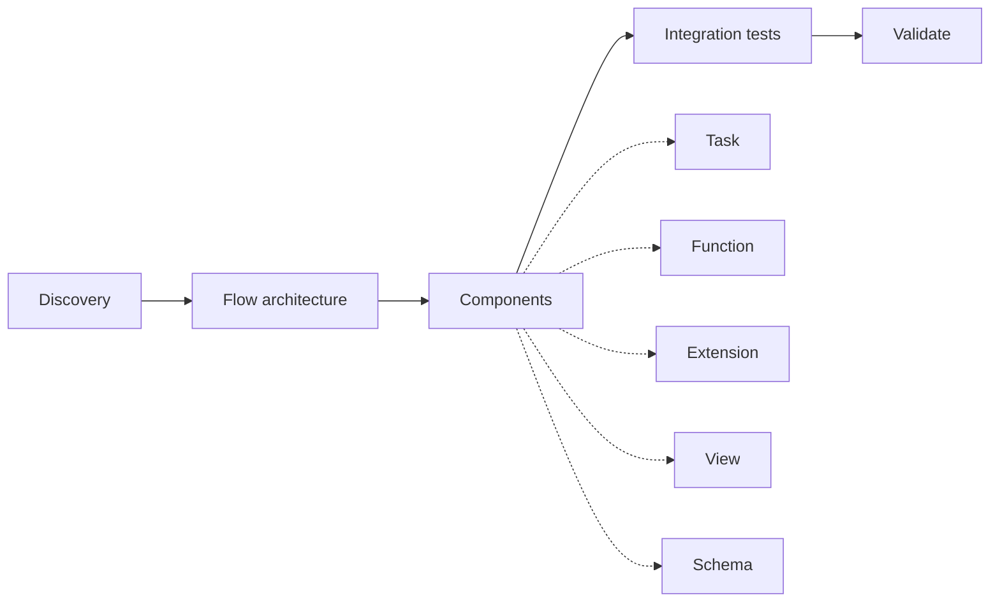

# vNext AI Toolkit

> Claude Code plugin for designing vNext processes with AI assistance — workflow scaffolding, view design, schema authoring, component generation, integration tests. **Canonical schema-first**: every component is generated from the official JSON Schema at the workspace's `schemaVersion` tag, never from hardcoded assumptions.

## What it is

The [vNext platform](https://burgan-tech.github.io/vnext-docs/) defines workflows as JSON component files: `workflow`, `view`, `schema`, `task`, `function`, `extension`. Building a process by hand means juggling many cross-references, getting enum values right, writing `.csx` mapping files against the right C# interfaces, and authoring integration tests. This plugin turns that work into a guided conversation with Claude.

Three things it gives you:

1. **A subagent** (`vnext-architect`) that walks you through designing a complete process — discovery → state machine → components → tests — through a structured decision tree.
2. **Eight skills** (`workflow-scaffold`, `view-design`, `schema-design`, `component-task`, `component-function`, `component-extension`, `integration-test`, `validate-and-fix`) for surgical edits to individual components.
3. **Three slash commands** (`/vnext-design-process`, `/vnext-init`, `/vnext-validate`) as entry points.

## Install

```bash
claude plugin install github:burgan-tech/vnext-ai-toolkit
```

Or, for development:

```bash
git clone https://github.com/burgan-tech/vnext-ai-toolkit.git ~/.claude/plugins/vnext-ai-toolkit
```

## Quickstart

In a new (or existing) vNext domain workspace:

```bash
# 1. Set up the workspace. If there's no vnext.config.json yet, this scaffolds the base
#    project with the official @burgan-tech/vnext-template CLI (npx), then layers on the
#    toolkit files (docker-compose, CLAUDE.md, tests/, ...). In an existing workspace it
#    checks & revises those toolkit files and offers to bump runtimeVersion/schemaVersion.
claude /vnext-init

# 2. Design your first workflow
claude /vnext-design-process "Account opening"

# 3. Validate everything
claude /vnext-validate
```

`/vnext-init` delegates the base scaffold (`vnext.config.json`, `package.json`, component folders) to
`@burgan-tech/vnext-template` and diffs before overwriting any toolkit-owned file — you can skip steps
that don't apply (no Docker, no integration tests, etc.).

## Design philosophy

### Canonical schema-first

The plugin's single most important rule: **no hardcoded enums, no assumed required fields, no guessed JSON shapes**. Every scaffolding skill fetches the matching JSON Schema from [`burgan-tech/vnext-schema`](https://github.com/burgan-tech/vnext-schema/tree/master/schemas) at your workspace's `schemaVersion` tag and drives every dropdown and skeleton from that schema. When vNext adds a new state type or task type, the plugin sees it on the next fetch — no code change required here.

See `references/concepts/component-schemas.md` for the full rule.

### Domain-agnostic

The plugin doesn't assume your domain is `core`. It reads `vnext.config.json` and resolves paths from `paths.componentsRoot` + `paths.{componentType}`. The reference workspace is [`burgan-tech/vnext-example`](https://github.com/burgan-tech/vnext-example), but the plugin works the same in `banking`, `payments`, or any other domain.

### Schema-driven, schema-validated

The plugin generates components that pass `npm run validate` on the first try — because the generator and the validator share one source of truth.

### Living docs, not stale snapshots

For evolving topics (pseudo-UI vocabularies, MockLab seed format, integration test SDK API), the plugin fetches from upstream repos at runtime instead of carrying stale copies. See `references/external-sources.md`.

## Decision tree (high level)



Each block delegates to a specific skill. See `references/decision-tree.md` for the full diagram and per-phase questions.

## What you'll have after `/vnext-design-process`

For a typical workflow:

- `{domain}/Workflows/{key}/{key}-workflow.json` — the state machine
- `{domain}/Workflows/{key}/src/*.csx` — C# mappings (IMapping, IConditionMapping, ITimerMapping, …)
- `{domain}/Workflows/{key}/{key}.http` — REST Client probe file
- `{domain}/Views/{group}/{key}-view.json` — one per state/transition view
- `{domain}/Schemas/{group}/{key}.json` — master schema + per-transition payloads
- `{domain}/Tasks/{group}/{key}.json` — HTTP/Script/SOAP/Dapr/Notification tasks
- `{domain}/Functions/{key}/{key}.json` (+ `src/*.csx`) — REST endpoints (LOV, lookup, BFF)
- `{domain}/Extensions/{key}/{key}.json` (+ `src/*.csx`) — instance enrichment
- `etc/docker/config/seed/{domain}-collection.json` — MockLab mock entries
- `tests/{Domain}.IntegrationTests/Tests/{Workflow}Tests.cs` — xUnit integration test (lifecycle assertion); the project is scaffolded by the official `VNext.Testing.Template`
- `api-tests/{key}.http` — companion REST Client file

All passing `npm run validate` and `dotnet test`.

## Repo layout

```
vnext-ai-toolkit/
├── .claude-plugin/plugin.json        # Manifest (skills/agents/commands)
├── agents/vnext-architect.md         # Multi-turn orchestrator
├── skills/                           # 8 skills
│   ├── workflow-scaffold/SKILL.md
│   ├── view-design/SKILL.md
│   ├── schema-design/SKILL.md
│   ├── component-task/SKILL.md
│   ├── component-function/SKILL.md
│   ├── component-extension/SKILL.md
│   ├── integration-test/SKILL.md
│   └── validate-and-fix/SKILL.md
├── commands/                         # 3 slash commands
│   ├── vnext-design-process.md
│   ├── vnext-init.md
│   └── vnext-validate.md
├── references/
│   ├── concepts/                     # 8 concept docs (workflow-types, view-roles, csx-contracts, ...)
│   ├── decision-tree.md
│   ├── external-sources.md
│   ├── view-author-guide.md          # pseudo-UI patterns
│   ├── function-mapping-pattern.md   # .csx mapping recipes
│   └── mocklab-seed-format.md        # MockLab seed reference
├── templates/                        # Toolkit value-add layer ({{domain}} placeholder)
│   │                                 #   (base project comes from @burgan-tech/vnext-template)
│   ├── docker-compose.yml.tmpl
│   ├── CLAUDE.md.tmpl / AGENTS.md.tmpl
│   ├── .http.tmpl
│   ├── etc/{docker,dapr}/...
│   └── tests/                        # Integration test scaffold
└── scripts/check-prerequisites.sh
```

## Compatibility

| Workspace `schemaVersion` | Plugin behavior |
|---------------------------|-----------------|
| Matches a tagged release of `vnext-schema` | Fetches exact tag — perfect alignment |
| Tag missing | Falls back to `master` with a warning |
| Offline | Falls back to in-repo snapshot (under `references/concepts/component-schemas.md`) with a warning |

| AI agent | Status |
|----------|--------|
| Claude Code | Primary target |
| Codex (via AGENTS.md) | Supported — every CLAUDE.md is mirrored to AGENTS.md |
| Cursor (.cursor/rules/*.mdc) | Planned |

## Related repos

- [`burgan-tech/vnext-example`](https://github.com/burgan-tech/vnext-example) — Reference workspace with working examples of every component type.
- [`burgan-tech/vnext-docs`](https://github.com/burgan-tech/vnext-docs) — Official documentation portal ([browse online](https://burgan-tech.github.io/vnext-docs/)).
- [`burgan-tech/vnext-schema`](https://github.com/burgan-tech/vnext-schema) — Canonical JSON Schemas + vocabularies (this plugin's contract source).
- [`burgan-tech/mocklab`](https://github.com/burgan-tech/mocklab) — Mock API used for HTTP task development.
- [`burgan-tech/vnext-integration-test`](https://github.com/burgan-tech/vnext-integration-test) — Integration testing SDK + `dotnet new vnext-integration-test` project template ([Getting Started](https://github.com/burgan-tech/vnext-integration-test/blob/master/GETTING_STARTED.md)).

## License

MIT — see [LICENSE](./LICENSE).

## Contributing

Issues and PRs welcome. When proposing a new skill or extending an existing one:

1. Confirm the change respects the canonical schema-first rule.
2. Add or update the relevant `references/concepts/*.md` if a new concept is introduced.
3. Update `CHANGELOG.md`.
