# Decision Tree — Designing a vNext Process

The `vnext-architect` subagent walks the user through this tree. Each level branches based on the user's answer; later levels delegate to specific skills. Enum option lists shown here are **conceptual**; the architect renders the actual options at runtime by fetching the canonical schemas (see `component-schemas.md`).

```mermaid
graph TD
  A[Process discovery: name, business goal] --> B{Process kind?}
  B -->|Approval / Application| C1[Workflow type F]
  B -->|Registration / Onboarding| C1
  B -->|Notification / Event-driven| C2[Workflow type F + heavy event hooks]
  B -->|Reusable sub-procedure| C3[Workflow type S — SubFlow]
  B -->|Parallel background work| C4[Workflow type P — SubProcess]
  C1 --> D[Actor model]
  C2 --> D
  C3 --> D
  C4 --> D
  D --> D1{Single actor or multi-actor?}
  D1 -->|Single| E
  D1 -->|Multi| D2[Add queryRoles<br/>$PreviousUser / $CurrentUser]
  D2 --> E[Complexity / nesting]
  E --> E1{Parallel branches or nested sequences?}
  E1 -->|None| F
  E1 -->|Reusable nested sequence| E2[Spin off SubFlow]
  E1 -->|Fire-and-forget parallel| E3[Spin off SubProcess]
  E2 --> F[Input model per state]
  E3 --> F
  F --> F1{How does the user provide input?}
  F1 -->|Single screen submit| G1[Intermediate state +<br/>transition view]
  F1 -->|Step-by-step| G2[Wizard state — stateType 5]
  F1 -->|Read-only progression| G3[Intermediate state +<br/>state view, no transition view]
  G1 --> H[Auto / timer triggers]
  G2 --> H
  G3 --> H
  H --> H1{Automatic decisions or timeouts?}
  H1 -->|Conditional auto| I1[triggerType 1 +<br/>IConditionMapping pair]
  H1 -->|Time-based| I2[triggerType 2 +<br/>ITimerMapping or static duration]
  H1 -->|Event-driven| I3[triggerType 3 — verify schema]
  H1 -->|None| J
  I1 --> J[External integrations]
  I2 --> J
  I3 --> J
  J --> J1{Calls outside the workflow?}
  J1 -->|REST| K1[HttpTask + IMapping]
  J1 -->|SOAP| K2[SoapTask + IMapping]
  J1 -->|Dapr service| K3[DaprService task]
  J1 -->|Message queue| K4[DaprPubSub task]
  J1 -->|Notification| K5[NotificationTask + INotificationMapping]
  J1 -->|Internal script| K6[ScriptTask + IMapping]
  J1 -->|None| L
  K1 --> L[Data enrichment]
  K2 --> L
  K3 --> L
  K4 --> L
  K5 --> L
  K6 --> L
  L --> L1{Need to enrich reads or expose endpoints?}
  L1 -->|Enrich every read| M1[Extension type/scope per matrix]
  L1 -->|REST endpoint client-callable| M2[Function scope D or I]
  L1 -->|None| N
  M1 --> N[Views]
  M2 --> N
  N --> N1{Renderer?}
  N1 -->|pseudo-ui — recommended| O1[Load vocabulary →<br/>build view tree]
  N1 -->|html / json / markdown / url / http / deeplink| O2[Type-specific content]
  O1 --> P[Schema design]
  O2 --> P
  P --> P1{Master schema + per-transition payloads?}
  P1 -->|Yes — standard| Q[Schema fields:<br/>types, validation, labels, roles]
  P1 -->|Schema already exists, reuse| Q
  Q --> R[Integration test]
  R --> R1{Smoke or full lifecycle?}
  R1 -->|Smoke| S1[SmokeTests + health check]
  R1 -->|Full lifecycle| S2[Workflow lifecycle test:<br/>start → transitions → final state]
  S1 --> T[Validate]
  S2 --> T
  T --> U[npm run validate +<br/>dotnet test]
```

## Phase summaries

### Phase 1 — Discovery (Level 0)

Ask: process name, business goal, who initiates, who consumes. Output:
- Workflow `type` (F/S/P/C) — **read enum from `workflow.json` schema**
- Domain (from `vnext.config.json`)
- Working title for the workflow key

### Phase 2 — Flow Architecture (Levels 1–4)

Determine:
- Actor model → `queryRoles[]` on workflow and selectively on states
- Complexity → SubFlow/SubProcess spin-offs
- State list (kind + view need) — `stateType` enum from schema
- Transition map — `triggerType` enum from schema
- Auto-pair correctness check

### Phase 3 — Component Design (Levels 5–7)

For each:
- **External integration**: choose Task type (HTTP/SOAP/Dapr/...) → `component-task` skill
- **Data enrichment**: Function (`component-function`) or Extension (`component-extension`)
- **Views**: renderer → `view-design`; data binding via schema
- **Schemas**: master + transition payloads → `schema-design`

### Phase 4 — Test (Level 8)

- `integration-test` skill produces test class
- Optional: companion `.http` file under `api-tests/`

### Phase 5 — Validate

- `validate-and-fix` skill runs `npm run validate` and (if integration tests scaffolded) suggests `dotnet test`

## Architect's question-asking style

- **One question at a time** when branches matter; cluster only when answers are clearly orthogonal (e.g., "Localization needed?" and "Role restrictions?" can come together).
- **Schema-rendered options**: never type out enum lists by hand — pull from `properties[X].enum` of the fetched schema and pass straight to `AskUserQuestion`.
- **Mark "(Recommended)"** when one option is clearly best (e.g. `pseudo-ui` renderer, `F` for top-level flows).
- **Allow "I don't know yet"**: provide a "Defer" option that records the decision as pending and continues — the user can revisit later.

## Skill-chain transitions

| Decision | Triggers |
|----------|----------|
| Workflow type decided | `workflow-scaffold` (after state/transition gather) |
| New schema needed | `schema-design` |
| New view needed | `view-design` |
| New task needed | `component-task` |
| New function needed | `component-function` |
| New extension needed | `component-extension` |
| Workflow scaffolded | `integration-test` (default: yes) |
| Anything written | `validate-and-fix` (always) |

Skills inherit the architect's gathered context — they don't re-ask information the architect already collected. The architect passes a structured "design brief" into each skill.
